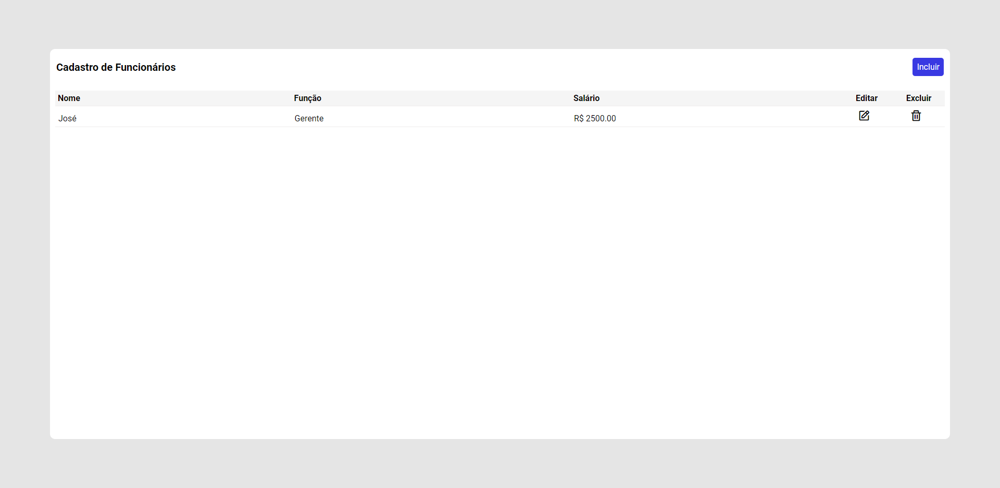
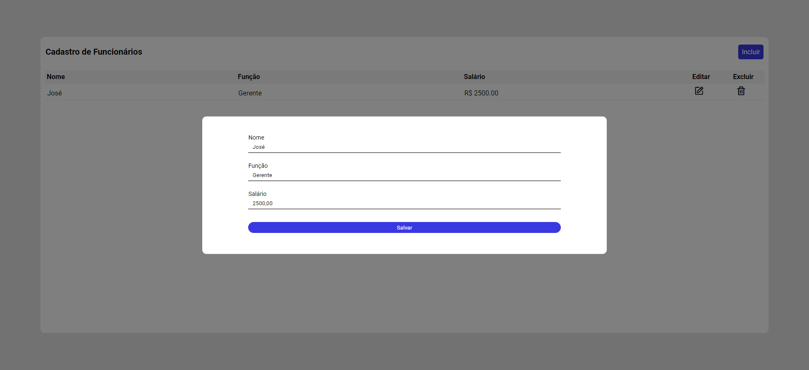

<h1 align="center"> CRUD - Cadastro de Funcionários </h1>

CRUD - Cadastro de Funcionários é um projeto desenvolvido com HTML, CSS e JavaScript, com base nos ensinamentos do [vídeo - Criando CRUD Responsivo com JavaScript (Projeto de Cadastro)](https://youtu.be/JxtQJ8P0ekE) do canal [@will_dev](https://www.youtube.com/@will_dev) no Youtube. 

 

  <a href="#-tecnologias">🚀 Tecnologias</a>&nbsp;&nbsp;&nbsp;|&nbsp;&nbsp;&nbsp;
  <a href="#-projeto">💻 Projeto</a>&nbsp;&nbsp;&nbsp;|&nbsp;&nbsp;&nbsp;
  <a href="#-layout">🔖 Layout</a>&nbsp;&nbsp;&nbsp;|&nbsp;&nbsp;&nbsp;
  <a href="#memo-licença">:memo: Licença</a>

 

  
  

 

## 🚀 Tecnologias

Esse projeto foi desenvolvido com as seguintes tecnologias:

 

## 💻 Projeto

O projeto é um sistema de CRUD para o cadastro de funcionários, nele é possível identificar o funcionário pelo nome, adicionando sua função e o seu salário. Existe ainda uma janela para de edição de dados. No que diz respeito ao armazenamento de dados foi utilizado o Local Storage. Vale salientar que o site é totalmente responsivo para dispositivos móveis.

 

## 🔖 Layout

Você pode navegar pelo projeto através [DESSE LINK](https://thiagomonts.github.io/crud-javascript/).

 

## :memo: Licença

Esse projeto está sob a licença MIT.

 

---

Desenvolvido por [Thiago Honorato](https://www.linkedin.com/in/honoratothiago/)
